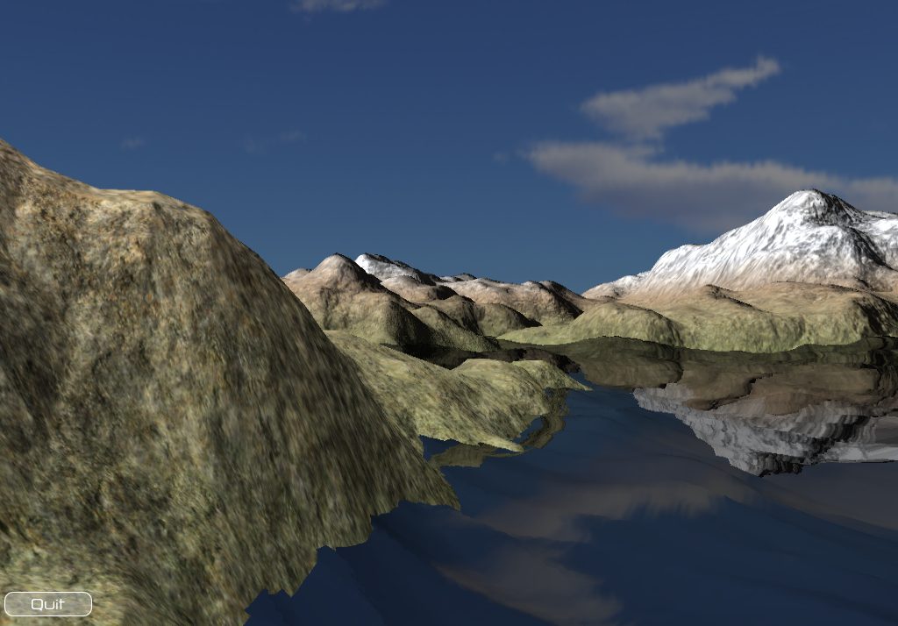
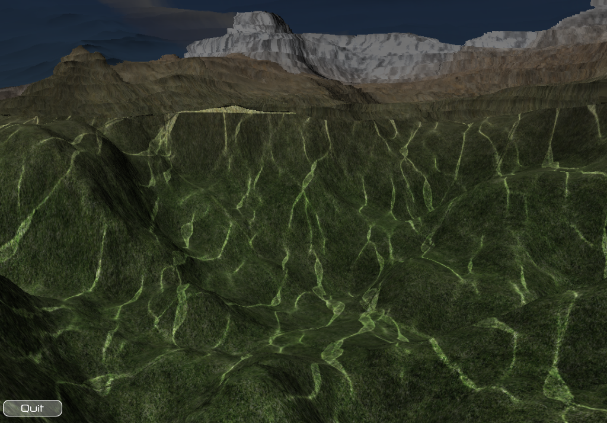
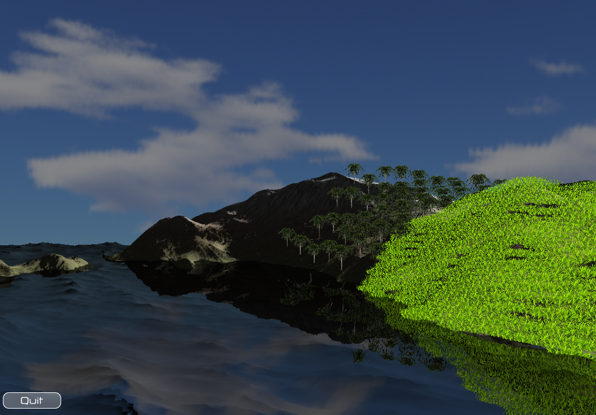
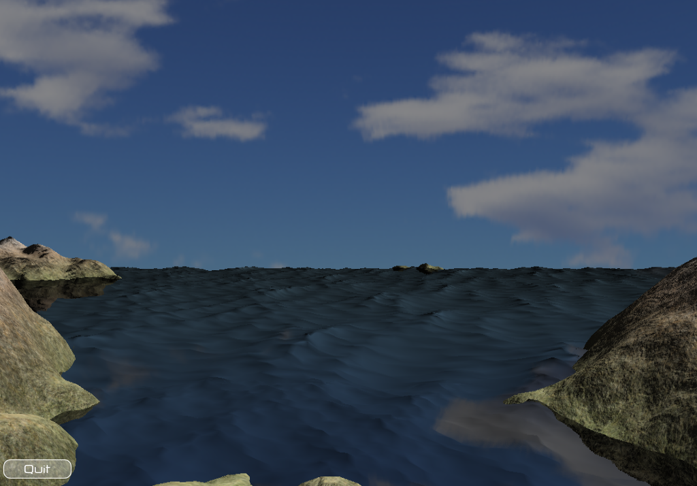
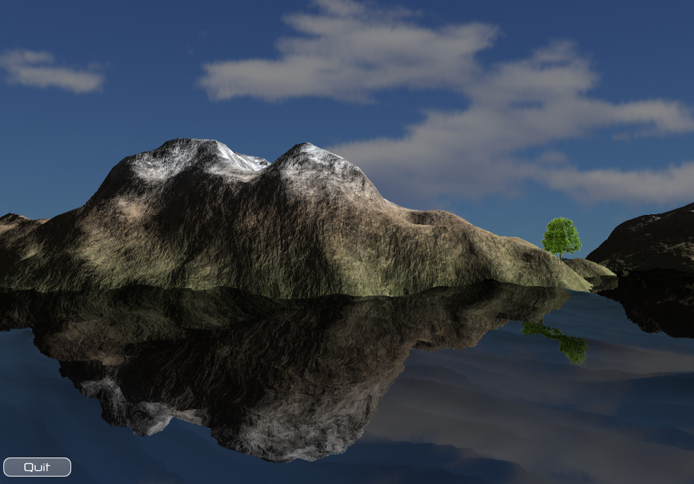
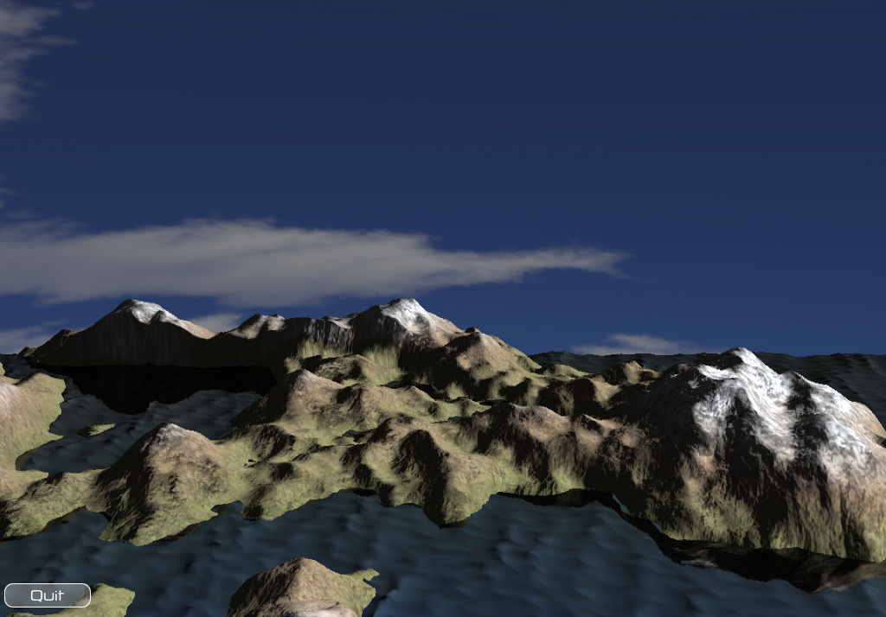
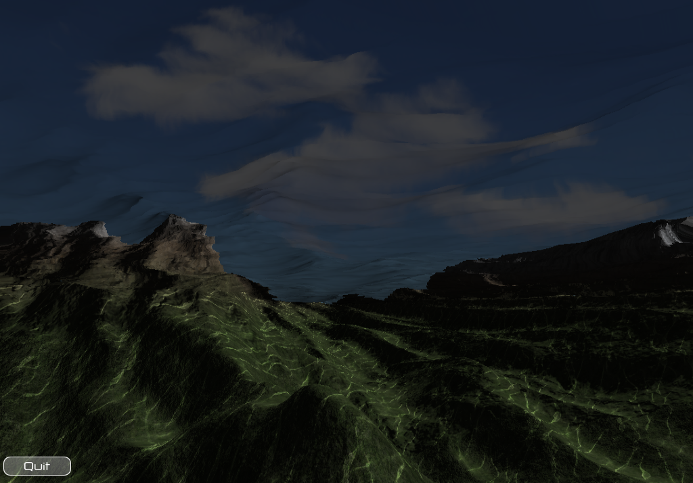
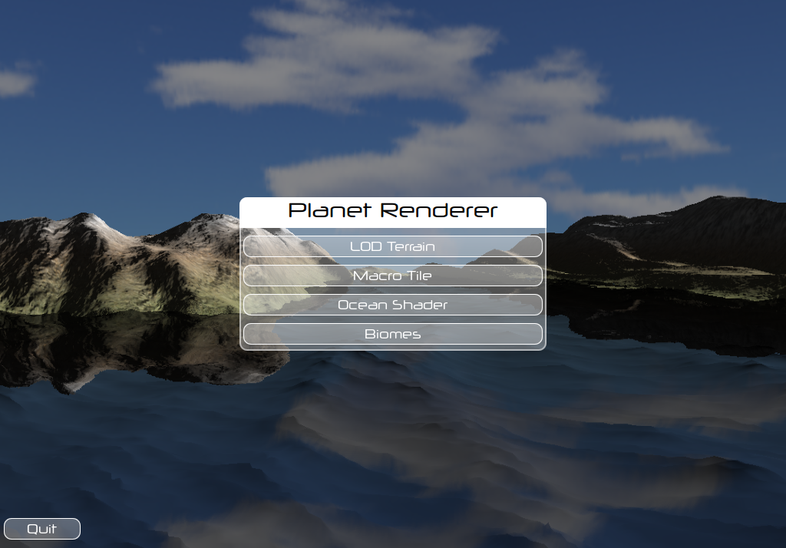

Planet Renderer
===============

This is a project targeting at making a GPU-based planet renderer.

Motivation
----------

I know a lot of people have already done a lot of work in similar projects, but I just want to give it a try and make my own planet.
With a planet, one can do a wide range of simulation, such as evolution, or even more ambitiously, a solar system, etc. It will be a lot of fun.

Project Progress
----------------
This is a final project for computer graphics course. It is currently not under active development. 
The output images have been generated by Arch Linux with Intel integrated graphics card. Output on other platforms with different graphics card/driver will not be guaranteed.










Installation
------------
This project uses CMake. Please install CMake &ge; 3.0.

Please use the following commands to compile:

```
mkdir build
cd build
cmake ..
make -j4
```

Basic features
--------------

+ Space navigation

+ Planet body rendering with LOD

+ Random terrain generation


Good-to-have features
----------------------

+ Planet with Atomsphere

+ Sea wave simulation


Possible Future Work
--------------------

+ Vegetation Rendering with L-System

+ Procedual City with L-System


Libraries Planned to Use
------------------------

+ OpenGL for graphics rendering

+ GLSL for GPU shader

+ Qt for GUI and OpenGL context

+ CMake for Project Management

Author
------
Tianyu Cheng

Xinya Zhang
