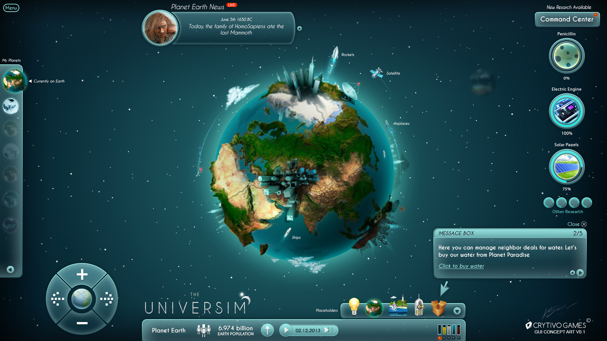

Planet Renderer
===============

This is a project targeting at making a GPU-based planet renderer.

Motivation
----------

I know a lot of people have already done a lot of work in similar projects, but I just want to give it a try and make my own planet.
With a planet, one can do a wide range of simulation, such as evolution, or even more ambitiously, a solar system, etc. It will be a lot of fun.

(credit: image from universe sim http://imgur.com/gallery/BDhnd)

Project Progress
---------------------

Basic features
----------------

+ Space navigation

+ Planet body rendering with LOD

+ Random terrain generation

Good-to-have features
----------------------

+ Planet with Atomsphere

+ Sea wave simulation

Possible Future Work
--------------------

+ Vegetation Rendering with L-System

+ Procedual City with L-System

Libraries Planned to Use
------------------------

+ OpenGL for graphics rendering

+ GLSL for GPU shader

+ Qt for GUI and OpenGL context

+ CMake for Project Management

Author
------
Tianyu Cheng

Xinya Zhang
